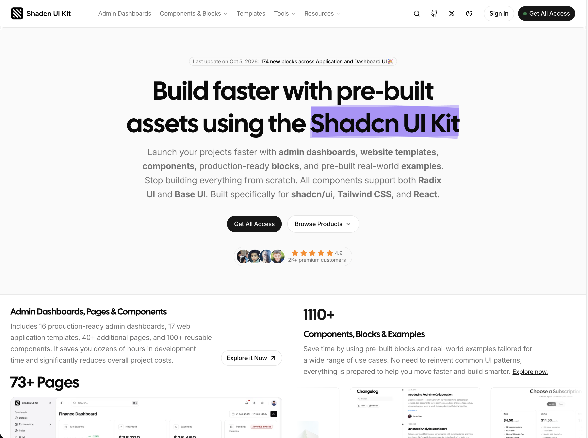
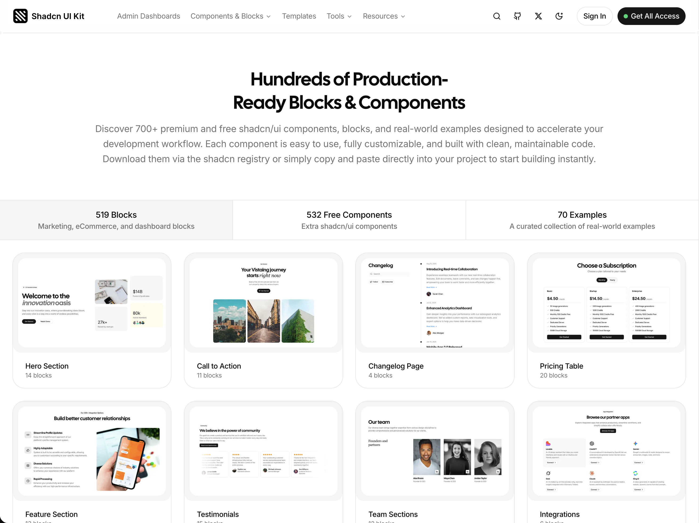
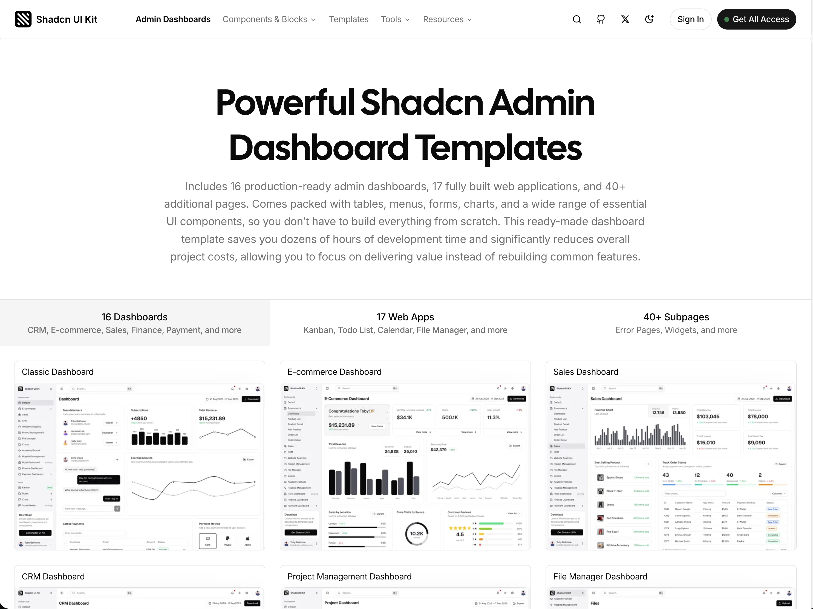
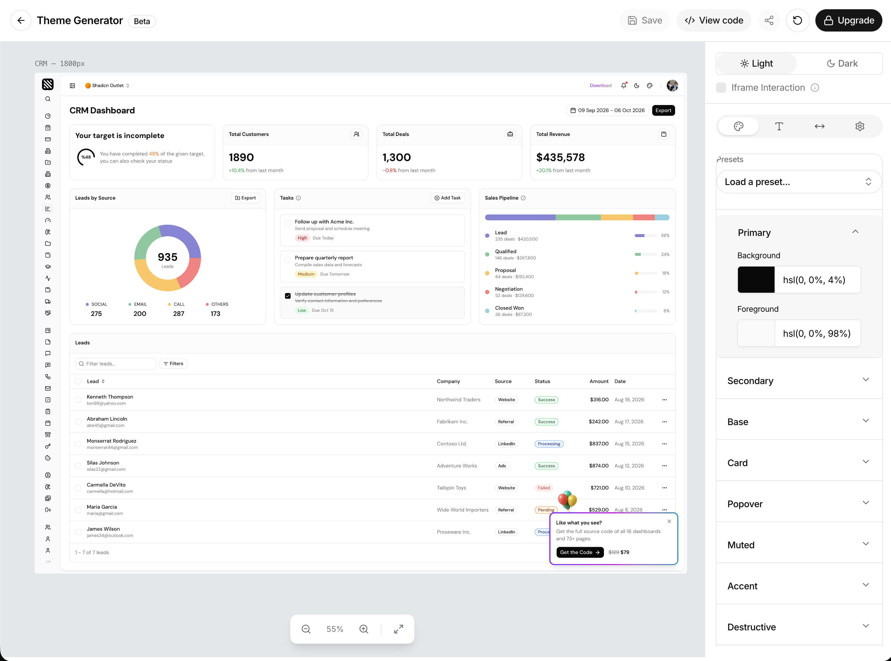
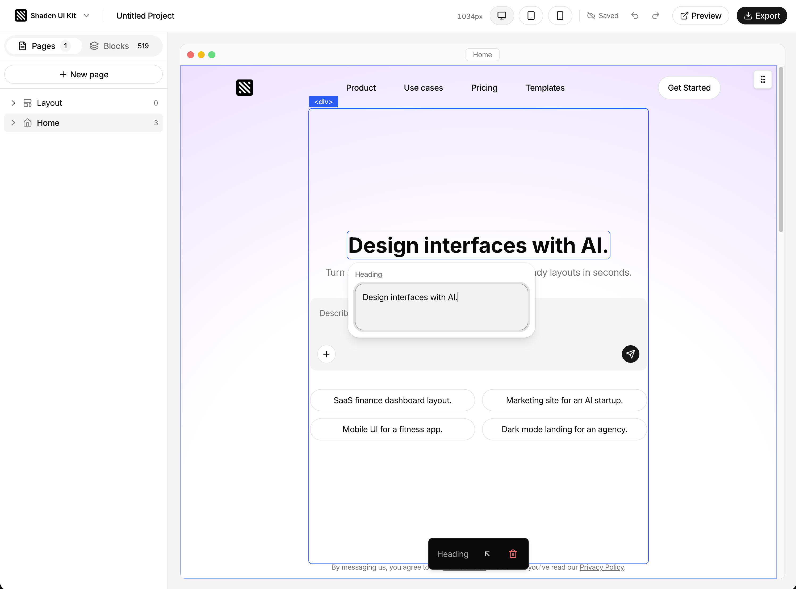

<a id="readme-top"></a>

<br />
<div align="center">
  <a href="https://shadcnuikit.com">
    
  </a>

  <h3 align="center">Shadcn UI Kit</h3>

  <p align="center">
    Free shadcn/ui components, blocks, examples and an admin dashboard template for React, Next.js and Tailwind CSS.
    <br />
    <br />
    <a href="https://shadcnuikit.com/">Website</a>
    &nbsp;&bull;&nbsp;
    <a href="https://shadcnuikit.com/admin-dashboard">Admin Dashboards</a>
    &nbsp;&bull;&nbsp;
    <a href="https://shadcnuikit.com/components">Components</a>
    &nbsp;&bull;&nbsp;
    <a href="https://shadcnuikit.com/blocks">Blocks</a>
    &nbsp;&bull;&nbsp;
    <a href="https://shadcnuikit.com/examples">Examples</a>
    &nbsp;&bull;&nbsp;
    <a href="https://shadcnuikit.com/illustrations">Illustrations</a>
    &nbsp;&bull;&nbsp;
    <a href="https://shadcnuikit.com/templates">Templates</a>
    &nbsp;&bull;&nbsp;
    <a href="https://shadcnuikit.com/pricing">Pricing</a>
  </p>
  <br />
</div>

## Table of Contents

- [About Shadcn UI Kit](#-about-shadcn-ui-kit)
- [What is included in the free edition](#-what-is-included-in-the-free-edition)
- [Screenshots](#-screenshots)
- [Examples and illustrations](#-examples-and-illustrations)
- [Tech stack](#-tech-stack)
- [Getting started](#-getting-started)
- [Install components with the shadcn CLI](#-install-components-with-the-shadcn-cli)
- [Project structure](#-project-structure)
- [Free vs Pro](#-free-vs-pro)
- [FAQ](#-faq)
- [Contact](#%EF%B8%8F-contact)
- [License](#-license)

## 💎 About Shadcn UI Kit

[Shadcn UI Kit](https://shadcnuikit.com) is a collection of admin dashboards, website templates, UI blocks, components and real-world examples built on top of [shadcn/ui](https://ui.shadcn.com), Tailwind CSS and React. It is made for developers and teams who want to ship production-ready interfaces without rebuilding the same tables, forms, charts and landing page sections for every project.

The full kit includes 16 admin dashboards, 17 complete web applications, 40+ extra pages, 1100+ components, blocks and examples, animated illustrations, premium website templates, a Theme Generator, a Page Builder and an MCP server for AI code editors. Every component supports both **Radix UI** and **Base UI** primitives, so it fits into any shadcn/ui project, whichever primitive library you use.

This repository is the **free and open source edition** of Shadcn UI Kit. It contains the free components, blocks and examples from the kit, a free admin dashboard template and the full source code of the browsing site, so you can run everything locally, read the code and copy what you need into your own project.

## 🎁 What is included in the free edition

- **527 free shadcn/ui components** in 49 categories: Accordion, Alert, Alert Dialog, Attachment, Autocomplete, Avatar, Badge, Breadcrumb, Button, Button Group, Calendar, Card, Carousel, Checkbox, Combobox, Command, Data Table, Drawer, Dropdown Menu, Empty State, Field, File Upload, Input, Item, Navigation Menu, Pagination, Popover, Progress, Radio Group, Select, Sheet, Skeleton, Slider, Sonner Toast, Switch, Table, Tabs, Textarea, Toggle, Tooltip and more.
- **Free UI blocks** for marketing sites and dashboards: hero sections, newsletter sections, how it works sections, FAQ sections, sign in forms, stat cards, modal dialogs, data tables and a todo app.
- **Real-world examples** such as review cards and date picker use cases, browsable at `/examples`.
- **A free admin dashboard template** at `/admin` with its own sidebar layout, a dashboard page with stat cards, an interactive area chart and a sortable data table, a users page, a settings page with a validated profile form, login and register pages, and 404 and 500 error pages.
- **A shadcn registry** for every free item, so you can install any block or component into your project with a single command.
- **Live previews** with responsive viewport switching (desktop, tablet, mobile), a dark mode toggle per preview and a "Get the Code" dialog with the full source of every item.

No database, authentication, payment provider or environment variables are required. Clone the repository, install the dependencies and run it.

## 📸 Screenshots

### Shadcn UI Kit homepage

<a href="https://shadcnuikit.com">
  
</a>

The Shadcn UI Kit homepage introduces the kit: production-ready admin dashboards, website templates, shadcn/ui components, UI blocks and real-world examples that support both Radix UI and Base UI. Below the hero you can see the admin dashboard preview with 73+ pages and the library of 1100+ components, blocks and examples, rated 4.9 by more than 2,000 premium customers.

### shadcn/ui blocks and components library

<a href="https://shadcnuikit.com/blocks">
  
</a>

The blocks and components library groups hundreds of production-ready shadcn/ui blocks by use case: hero sections, call to action sections, changelog pages, pricing tables, feature sections, testimonials, team sections, integrations and more. Each block can be previewed live, copied as code or installed through the shadcn registry. The library is split into marketing, eCommerce and dashboard blocks, free components and curated real-world examples.

### Shadcn admin dashboard templates

<a href="https://shadcnuikit.com/admin-dashboard">
  
</a>

Shadcn UI Kit includes 16 production-ready admin dashboard templates (classic, e-commerce, sales, CRM, finance, payment, project management, file manager, crypto, analytics, hospital, hotel, HR, real estate and more), 17 fully built web applications such as kanban, todo list, calendar and file manager, and 40+ subpages like error pages and widgets. Every dashboard is built with Next.js, React, Tailwind CSS and shadcn/ui, with tables, menus, forms and charts ready to use.

### Theme Generator for shadcn/ui

<a href="https://shadcnuikit.com/theme-generator">
  
</a>

The Theme Generator lets you design a shadcn/ui theme visually and preview it on a real CRM dashboard while you edit. Pick a preset, adjust the primary, secondary, card, popover, muted, accent and destructive colors for light and dark mode, change typography and spacing, and copy the generated Tailwind CSS v4 variables into your `globals.css`.

### Page Builder for shadcn/ui blocks

<a href="https://shadcnuikit.com/page-builder">
  
</a>

The Page Builder turns shadcn/ui blocks into complete websites. Pick from 519 blocks, arrange them into pages, edit headings, text, images and links directly on the canvas, check the result on desktop, tablet and mobile, and export a clean Next.js project or add the pages to your app with the shadcn CLI.

## 🧩 Examples and illustrations

### Real-world shadcn/ui examples

[Shadcn UI examples](https://shadcnuikit.com/examples) are complete, real-world UI patterns built from shadcn/ui components, ready to drop into a product. Instead of isolated primitives you get finished pieces of interface: blog cards, chat bubbles, payment method cards, product cards and product lists, social media posts, review cards, stat cards, task cards and welcome cards, ecommerce, line and project management charts, date picker use cases, user dropdown menus, authentication forms, switch cards and theme switchers. Every example has a live preview, a responsive viewport switcher and its full source code, and can be installed with the shadcn CLI.

The free edition includes the review card examples and the date picker use cases. The full collection of 70 examples is available on [shadcnuikit.com/examples](https://shadcnuikit.com/examples).

### Animated illustrations for shadcn/ui

[Shadcn UI Kit illustrations](https://shadcnuikit.com/illustrations) are animated React illustrations and motion components built with Tailwind CSS and Motion. They follow your shadcn/ui theme colors automatically, so they match light mode, dark mode and any custom theme without editing a single SVG. Use them in hero sections, feature sections, empty states, onboarding screens and product tours to explain a feature visually instead of with a static screenshot. Each illustration is a regular React component that you can install through the registry and customize like the rest of your code.

The illustrations are part of [Shadcn UI Kit Pro](https://shadcnuikit.com/pricing).

> The Theme Generator, Page Builder, illustrations, premium blocks, admin dashboards and templates are part of [Shadcn UI Kit Pro](https://shadcnuikit.com/pricing). This repository contains the free edition.

## 🧰 Tech stack

- [Next.js 16](https://nextjs.org) with the App Router
- [React 19](https://react.dev)
- [Tailwind CSS v4](https://tailwindcss.com)
- [shadcn/ui](https://ui.shadcn.com) with [Radix UI](https://www.radix-ui.com) and [Base UI](https://base-ui.com) primitives
- [TypeScript](https://www.typescriptlang.org)
- [TanStack Table](https://tanstack.com/table), [Recharts](https://recharts.org), [React Hook Form](https://react-hook-form.com), [Zod](https://zod.dev) and [dnd kit](https://dndkit.com)
- [Lucide](https://lucide.dev) and [Tabler](https://tabler.io/icons) icons

## 🚀 Getting started

Requirements: Node.js 20 or later and [pnpm](https://pnpm.io).

```bash
git clone https://github.com/bundui/shadcn-ui-kit.git
cd shadcn-ui-kit
pnpm install
pnpm dev
```

Open [http://localhost:3000](http://localhost:3000) to browse the components, blocks and examples, and [http://localhost:3000/admin](http://localhost:3000/admin) to see the free admin dashboard.

Other scripts:

| Command               | Description                                         |
| --------------------- | --------------------------------------------------- |
| `pnpm dev`            | Start the development server                        |
| `pnpm build`          | Create a production build                           |
| `pnpm start`          | Run the production build                            |
| `pnpm registry:build` | Regenerate the registry files in `public/r`         |

## 📦 Install components with the shadcn CLI

Every free component, block and example is published in the Shadcn UI Kit registry. Add the registry to your `components.json`:

```json
{
  "registries": {
    "@shadcnuikit": "https://shadcnuikit.com/r/{name}.json"
  }
}
```

Then install any item by its name:

```bash
npx shadcn@latest add @shadcnuikit/hero1
```

The exact install command for each item is shown in its "Get the Code" dialog, for npm, pnpm, yarn and bun.

## 🗂️ Project structure

```
app/
  (landing)/        site pages: home, components, blocks, examples, templates
  admin/            free admin dashboard with its own layout
    (dashboard)/    dashboard, users and settings pages
    (guest)/        login, register, 404 and 500 pages
  demo/             isolated preview page used by the live previews
components/
  admin/            admin dashboard components (sidebar, header, charts, tables)
  sections/         homepage sections
  ui/               shadcn/ui primitives
contents/           source code of every component, block and example
docs/screenshots/   images used in this README
public/r/           generated shadcn registry files
registry.json       registry index of every free item
```

To add a new item, create it in `contents`, add it to the matching category file in `app/(landing)` and to `registry.json`, then run `pnpm registry:build`.

## ⚖️ Free vs Pro

| Free edition (this repository)          | [Shadcn UI Kit Pro](https://shadcnuikit.com/pricing)      |
| --------------------------------------- | --------------------------------------------------------- |
| 1 admin dashboard template              | ✔ 16 admin dashboards                                     |
| 7 dashboard pages                       | ✔ 17 web apps and 40+ extra pages                         |
| 527 components                          | ✔ 1100+ components, blocks and examples                   |
| 16 blocks                               | ✔ 500+ premium blocks for marketing, eCommerce and apps   |
| 14 examples                             | ✔ 70 real-world examples                                  |
|                                         | ✔ Animated illustrations that follow your theme           |
| Light and dark mode                     | ✔ Premium website templates                               |
| shadcn registry for free items          | ✔ Theme Generator and Page Builder                        |
| MIT license                             | ✔ MCP server for Claude Code, Cursor and other AI editors |
|                                         | ✔ Lifetime access and free updates                        |

✅ [Get Shadcn UI Kit Pro](https://shadcnuikit.com/pricing) to unlock everything with a one-time payment.

## ❓ FAQ

**Is Shadcn UI Kit free?**
This repository is free and open source under the MIT license. It includes 527 components, free blocks, examples and an admin dashboard template. The premium dashboards, blocks, templates and tools are available with [Shadcn UI Kit Pro](https://shadcnuikit.com/pricing).

**Does it work with Radix UI and Base UI?**
Yes. Every component works with both Radix UI and Base UI primitives, so you can use it in any shadcn/ui setup.

**Can I use it with Vite, Remix or TanStack Start?**
Yes. The components are plain React and Tailwind CSS. Replace `next/link` and `next/image` with regular elements when you use them outside of Next.js.

**Can I use it in commercial projects?**
Yes. The free edition is MIT licensed, so you can use it in personal, commercial and client projects.

**Is this an official shadcn/ui project?**
No. Shadcn UI Kit is an independent product built on top of shadcn/ui and is not affiliated with the official shadcn/ui project.

## ✉️ Contact

Toby Belhome: [@TobyBelhome](https://x.com/TobyBelhome) on X, or email [hello@tobybelhome.com](mailto:hello@tobybelhome.com).

Found a bug or have an idea? [Open an issue](https://github.com/bundui/shadcn-ui-kit/issues).

## 📄 License

Released under the [MIT License](LICENSE).

<p align="right">(<a href="#readme-top">back to top</a>)</p>
